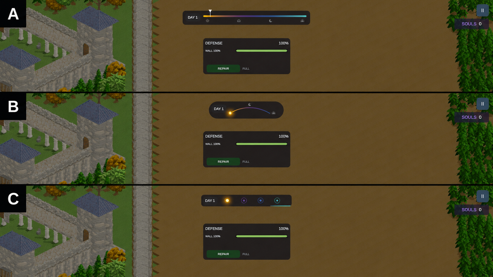

# DW-I Phase HUD Presentation Decision

## Karar durumu

- Tarih: 2026-07-15
- Owner kararı: `B - Celestial Dial`
- Aktif uygulama hedefi: `B`
- Geri dönülebilir arşiv alternatifi: `A - Horizon Ribbon`
- Seçilmemiş alternatif: `C - Phase Pips`

Bu karar, `DEAD_WALLS_GAME_DESIGN_BLUEPRINT_v1.0` sayfa 25 ve 39'da açık bırakılan phase widget polish kapısını kapatır. Aktif prefab gerçeği `Assets/Prefabs/UI/Generated/MobileCastleHudRoot.prefab` olarak kalır.

## Görsel referans

Referans görsel konsept yönünü gösterir; runtime ölçü, binding ve davranış sözleşmesi aşağıdaki metindir.

## Seçilen B - Celestial Dial

- Üst ortada top-center anchor'lı, `290 x 68` gerçek pill siluetli koyu charcoal capsule; gövde ve flat dairesel uç kapakları referans B oranını ve tek-parça tonunu korur.
- Sol tarafta yalnız `DAY N` run-day sayacı.
- Sağ tarafta `178 x 44` alanda Day -> Dusk -> Night -> Dawn renk yönünü taşıyan, 44 segmentle pürüzsüzleştirilmiş sığ göksel yay.
- Referansta bulunmayan dikey ayırıcı kullanılmaz; crescent moon ve horizon-dawn glyph'leri yayın kendi kompozisyonuna dahildir.
- Cycle marker, `CycleProgress01` ile yayın başından sonuna kesintisiz hareket eder.
- Marker rengi aktif faza göre Day amber, Dusk indigo, Night cold blue, Dawn cyan/gold olur.
- Faz değişiminde marker ve halo rengi `250 ms` smooth crossfade yapar.
- Büyük phase adı, ham `DAY / DUSK / NIGHT` label satırı ve tam ekran geçiş yazısı kullanılmaz.
- Sürekli dikkat isteyen pulse yoktur; yalnız marker'ın düşük alpha `0.22` halo'su ve küçük parlak çekirdeği bulunur.
- Widget input/raycast almaz ve battlefield görünürlüğünü engellemez.

## Arşivlenen A - Horizon Ribbon

A silinmez veya unutulmuş fikir sayılmaz. Owner istediğinde B yerine uygulanabilecek onay bekleyen alternatif olarak korunur.

- Yaklaşık `300 x 40` koyu yarı saydam yatay strip.
- Sol tarafta `DAY N` rozeti.
- Day -> Dusk -> Night -> Dawn yönünü tek ince renk bandı gösterir.
- Cycle konumu parlak dikey needle ile okunur.
- Küçük celestial glyph'ler faz yönünü destekler; büyük phase label satırı geri gelmez.
- Faz değişiminde needle/strip accent'i `250 ms` glow crossfade yapar.

### A'ya dönüş prosedürü

1. Bu dokümandaki aktif karar `A` olarak değiştirilir.
2. `CyclePanel` aynı top-center slotta kalır; runtime cycle owner değişmez.
3. Celestial arc presentation, horizontal ribbon presentation ile değiştirilir.
4. Aynı day counter ve `CycleProgress01` binding'leri yeniden kullanılır.
5. Prefab layout testi ve 16:9/ultrawide Game View QA yeniden çalıştırılır.

## Değiştirilmeyecek sınırlar

- 60 saniyelik `30 / 5 / 20 / 5` cycle davranışı değişmez.
- Spawn yoğunluğu veya gameplay tuning bu UI kararından etkilenmez.
- Horde forecast/pressure bilgisi phase widget'a eklenmez.
- Day/night atmosferi esas olarak world lighting, color grading ve audio ile okunmaya devam eder.
- UI export/import hattı kullanılmaz; aktif generated prefab doğrudan Prefab Stage içinde düzenlenir.
